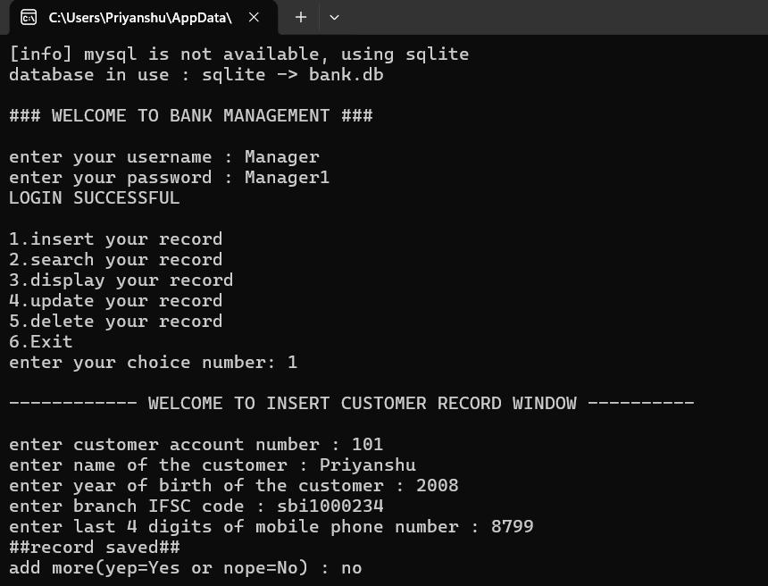
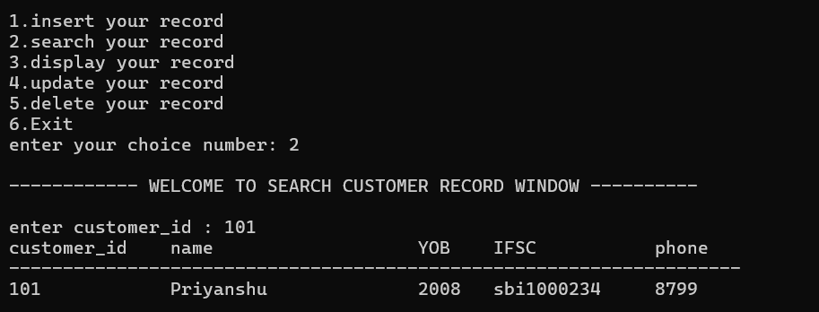
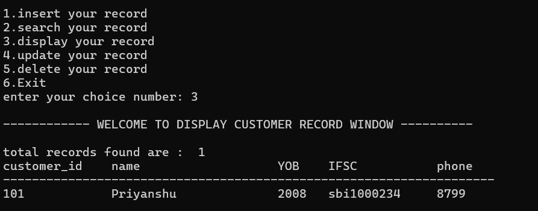
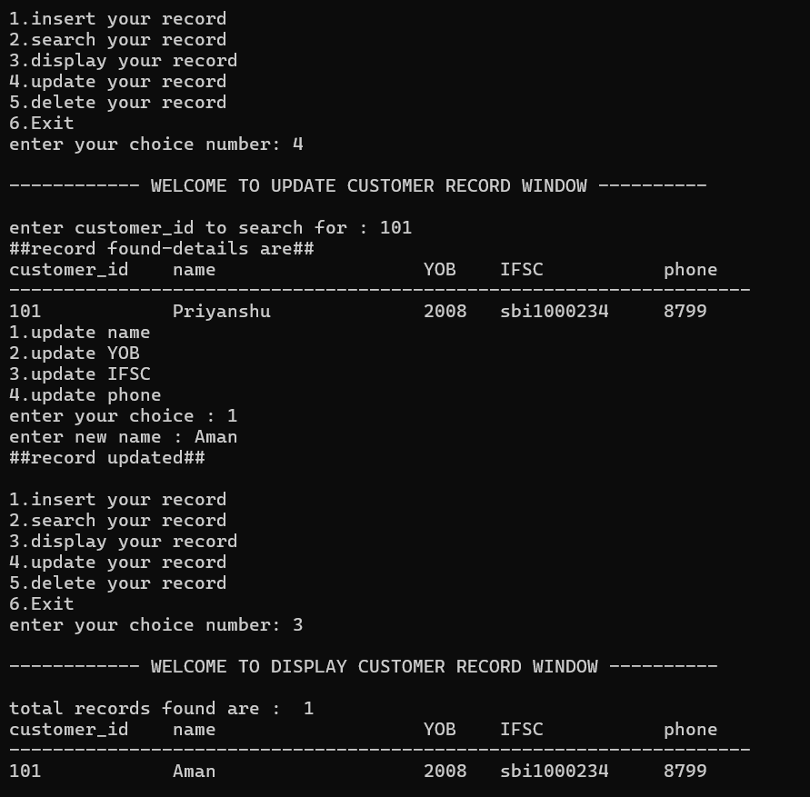
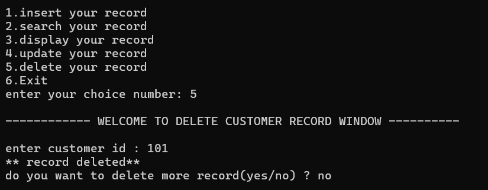

# Bank Management System

## 1. Project Title

**Bank Management System**

A command-line based bank management project developed using Python. The project is designed to store and manage customer records through a simple menu-driven interface.

---

## 2. Overview of the Project

The **Bank Management System** is a Python-based application that allows users to manage customer banking records from the terminal.

The system provides basic database operations such as adding, searching, displaying, updating, and deleting customer records. It also includes a login system with three predefined user accounts.

The project supports two database options:

- **MySQL** for the main database setup
- **SQLite** as a local alternative when MySQL is not available

The application can automatically create the required database/table when it starts.

---

## 3. Features

The main features of the project are:

- User login with username and password
- Maximum of 3 login attempts
- Add new customer records
- Search for a customer using the customer/account number
- Display all customer records
- Update customer details
- Delete customer records
- Prevent duplicate customer/account numbers
- Input validation for numbers and empty text fields
- MySQL database support
- SQLite database support
- Automatic fallback to SQLite when MySQL is unavailable in automatic mode
- Command-line options for selecting the database and SQLite file
- Automatic creation of the `customer` table if it does not already exist

---

## 4. Technologies / Tools Used

| Technology / Tool | Purpose |
| --- | --- |
| **Python** | Main programming language |
| **MySQL** | Database option for storing customer records |
| **SQLite** | Local database alternative |
| **mysql-connector-python** | Connects Python with MySQL |
| **sqlite3** | Connects Python with SQLite; included with Python |
| **argparse** | Handles command-line options |
| **Git & GitHub** | Version control and project hosting |

### Python version

The project can be run using **Python 3.8 or newer**.

---

## 5. Installation and Running the Project

### Step 1: Open the project folder

Open a terminal/Command Prompt/PowerShell and move to the folder containing `Bank.py`.

```bash
cd "Bank_python Project"
```

### Step 2: Check Python installation

```bash
python --version
```

If `python` does not work, try:

```bash
python3 --version
```

or on Windows:

```bash
py --version
```

### Step 3: Install the required package

For MySQL support, install the package from `requirements.txt`:

```bash
python -m pip install -r requirements.txt
```

SQLite mode does not require any additional package.

---

## 6. Database Setup

### Option A: Run using SQLite

SQLite is the easiest option because it does not require a separate database server.

Run:

```bash
python Bank.py --db sqlite
```

The program will create/use a file named:

```text
bank.db
```

inside the project folder.

### Option B: Run using MySQL

Make sure MySQL Server is installed and running.

The project uses the following environment variables for MySQL:

```ini
DB_HOST=localhost
DB_PORT=3306
DB_USER=root
DB_PASSWORD=your_mysql_password
DB_NAME=bank
```

These values can be placed in a file named `.env` in the project folder.

The program creates the `bank` database and the `customer` table automatically when MySQL mode is used.

The SQL file can also be used manually:

```bash
mysql -u root -p < Bank.sql
```

Then run the program with:

```bash
python Bank.py --db mysql
```

### Automatic database selection

If no database option is specified:

```bash
python Bank.py
```

the program first tries to connect to MySQL. If MySQL is not available, it uses SQLite instead.

---

## 7. How to Use the Project

After starting the program, enter one of the available login accounts.

### Login accounts

| Username | Password |
| --- | --- |
| `Manager` | `Manager1` |
| `Employee` | `Employee1` |
| `customer` | `admin` |

After a successful login, the main menu is displayed:

```text
1.insert your record
2.search your record
3.display your record
4.update your record
5.delete your record
6.Exit
```

### Menu operations

**1. Insert**  
Adds a new customer record. The customer ID, name, year of birth, IFSC code and last four digits of the phone number are entered.

**2. Search**  
Searches for a customer using the customer ID.

**3. Display**  
Displays all customer records stored in the database.

**4. Update**  
Allows the user to update the name, year of birth, IFSC code or phone number of an existing customer.

**5. Delete**  
Deletes a customer record using the customer ID.

**6. Exit**  
Closes the application.

---

## 8. Instructions for Testing

The following tests can be performed to check the main functions of the project.

### Test 1: Login

Run:

```bash
python Bank.py --db sqlite
```

Use:

```text
Username: Manager
Password: Manager1
```

Expected result:

```text
LOGIN SUCCESSFUL
```

### Test 2: Add a customer

Select option `1` and enter sample data such as:

```text
Customer ID: 101
Name: Priyanshu Kumar
Year of Birth: 2005
IFSC: SBIN0001234
Phone: 4321
```

Expected result:

```text
##record saved##
```

### Test 3: Search a customer

Select option `2` and enter:

```text
101
```

The saved customer record should be displayed.

### Test 4: Display records

Select option `3`.

All records stored in the database should be displayed.

### Test 5: Update a record

Select option `4`, enter an existing customer ID, and choose the field to update.

The program should display:

```text
##record updated##
```

### Test 6: Delete a record

Select option `5`, enter an existing customer ID, and confirm the operation.

The program should display:

```text
** record deleted**
```

### Test 7: Duplicate customer ID

Try to add another customer using an already existing customer ID.

Expected result:

```text
##this account number is already used, record not saved##
```

### Test 8: Invalid input

Enter letters where a number is required.

The program should display:

```text
enter numbers only
```

### Test 9: Wrong login

Enter an incorrect username/password.

The program allows up to three login attempts before closing.

---

## 9. Screenshots

The following screenshots show the main working features of the Bank Management System.

### Login and Insert Customer Record



### Search Customer Record



### Display Customer Records



### Update Customer Record



### Delete Customer Record




## 10. Database Structure

The project uses a table named `customer`.

| Column | Type | Description |
| --- | --- | --- |
| `customer_id` | INT PRIMARY KEY | Unique customer/account number |
| `name` | VARCHAR(30) | Customer name |
| `YOB` | VARCHAR(5) | Year of birth |
| `IFSC` | VARCHAR(15) | Branch IFSC code |
| `phone_number` | INT | Last four digits of the phone number |

---

## 11. Project Files

```text
Bank_python Project/
│
├── Bank.py
├── Bank.sql
├── README.md
├── statement.md
├── requirements.txt
├── .env.example
└── .gitignore
```

### File description

- **Bank.py** — Main Python program containing the login system, menu and database operations.
- **Bank.sql** — SQL commands for creating the MySQL database and `customer` table.
- **README.md** — Project documentation, installation instructions, usage information and testing instructions.
- **statement.md** — Contains the project's problem statement, scope, target users and high-level features.
- **requirements.txt** — Contains the MySQL connector package required for MySQL mode.
- **.env.example** — Example configuration file showing the MySQL environment variables required by the project. Copy it to `.env` and enter the actual MySQL details.
- **.gitignore** — Specifies local files such as `.env`, database files, Python cache files, virtual environments and generated files that should not be uploaded to GitHub.


## 12. Command-Line Options

The program also supports the following options:

| Command | Purpose |
| --- | --- |
| `python Bank.py` | Automatically try MySQL first and use SQLite if unavailable |
| `python Bank.py --db mysql` | Use MySQL |
| `python Bank.py --db sqlite` | Use SQLite |
| `python Bank.py --sqlite-file test.db --db sqlite` | Use a custom SQLite database file |
| `python Bank.py --help` | Display available command-line options |

---

## 13. Conclusion

The Bank Management System demonstrates the use of Python with database connectivity to perform basic customer record management. It provides a simple command-line interface and supports both MySQL and SQLite, making the project easy to run and test in different environments.
